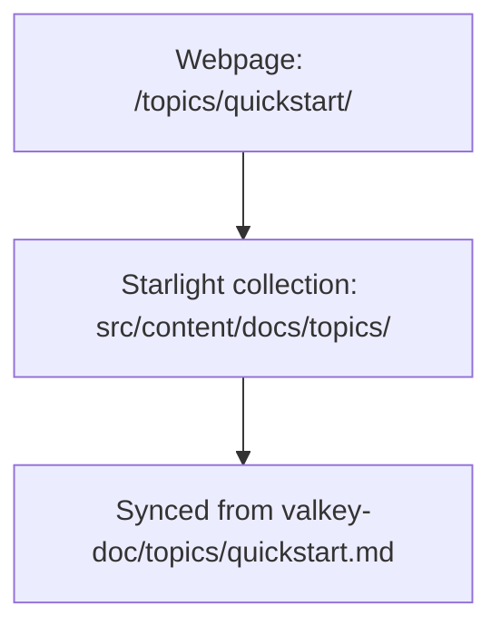

# Valkey.io website (Astro prototype)

This repo contains a prototype migration of the [valkey.io](https://valkey.io)
website from [Zola](https://www.getzola.org/) to
[Astro](https://astro.build) + [Starlight](https://starlight.astro.build).
The build integrates content from
[`valkey-io/valkey-doc`](https://github.com/valkey-io/valkey-doc)
and command definitions from
[`valkey-io/valkey`](https://github.com/valkey-io/valkey),
[`valkey-io/valkey-bloom`](https://github.com/valkey-io/valkey-bloom),
[`valkey-io/valkey-json`](https://github.com/valkey-io/valkey-json),
and [`valkey-io/valkey-search`](https://github.com/valkey-io/valkey-search)
(see [Build Locally](#build-locally) below).

The marketing site, documentation topics, command reference, client
libraries, blog, leadership, events, community pages, and the GLIDE docs
are unified under one domain with one search index and one navigation chrome.

A live preview of the prototype is available at
[valkey.alexey-temnikov.com](https://valkey.alexey-temnikov.com/).

## Contributing

Ideas, suggestions, and PRs are welcome. The proposal to migrate the
upstream site is tracked at
[valkey-io/valkey-io.github.io](https://github.com/valkey-io/valkey-io.github.io).

## Build Locally

This site is built with [Astro](https://astro.build) and
[Starlight](https://starlight.astro.build), using
[pnpm](https://pnpm.io/) as the package manager and
[Pagefind](https://pagefind.app/) for site-wide search.

Prerequisites:

- Node.js 20 or newer (Node 22 is used in CI)
- pnpm 9 or newer
- A local clone of [`valkey-io/valkey-doc`](https://github.com/valkey-io/valkey-doc)
  as a sibling directory (required: topics + command descriptions)

Optional sibling repos (the build still succeeds without them, but the
corresponding command pages will be missing):

- [`valkey-io/valkey`](https://github.com/valkey-io/valkey)
- [`valkey-io/valkey-bloom`](https://github.com/valkey-io/valkey-bloom)
- [`valkey-io/valkey-json`](https://github.com/valkey-io/valkey-json)
- [`valkey-io/valkey-search`](https://github.com/valkey-io/valkey-search)

Layout on disk:

```
your-workspace/
├── valkey-site-astro/   # this repo
├── valkey-doc/          # required
├── valkey/              # optional
├── valkey-bloom/        # optional
├── valkey-json/         # optional
└── valkey-search/       # optional
```

Then, from inside `valkey-site-astro/`:

```shell
pnpm install
pnpm dev    # development server with HMR at http://localhost:4321/
```

Or to produce a static build:

```shell
pnpm build  # outputs to dist/
pnpm preview
```

`pnpm build` runs the `scripts/sync-topics.sh` step before building. That
script copies the topic Markdown from `../valkey-doc/topics/` into the
Starlight content collection at `src/content/docs/topics/` so the docs
pick up the latest topic content on every build.

The command reference is loaded at build time by `src/lib/commands.ts`,
which walks the four product repos for command JSON and merges with the
matching `*.md` description in `valkey-doc/commands/`.

## How content flows into pages

Documentation topics (`/topics/quickstart/`, `/topics/encryption/`, …)
come from `valkey-doc/topics/*.md`:



Command pages (`/commands/set/`, `/commands/get/`, …) merge command
metadata from the product repos with descriptions from valkey-doc:

```mermaid
flowchart TD
    A[Webpage: /commands/set/]
    A --> B[Astro page: src/pages/commands/[command].astro]
    B --> F[Repo: valkey-io/valkey] --> G[File: src/commands/set.json] --> X[Command metadata]
    B --> H[Repo: valkey-io/valkey-doc] --> I[File: commands/set.md] --> Y[Command description]
    H --> J[Files: resp2_replies.json,<br/>resp3_replies.json] --> Z[Command reply]
```

Client libraries (`/clients/`) are sourced from
`valkey-doc/clients/<lang>/*.json`. Blog posts, events, community pages,
authors, releases, and the homepage participants list live as content
collections inside `src/content/`.

## Site structure

```
valkey-site-astro/
├── astro.config.mjs              # Starlight wiring, redirects, remark plugin
├── scripts/
│   ├── sync-topics.sh            # Copies valkey-doc/topics/ into the collection
│   └── fix-glide-links.mjs       # Post-build: fixes root-relative GLIDE links
├── public/
│   ├── fonts/                    # Open Sans / Condensed / Noto Serif / Fira Mono
│   ├── img/                      # Logos, icons, hero background
│   ├── assets/blog/<slug>/       # Per-post images
│   ├── assets/media/authors/     # Author profile photos
│   ├── glide/                    # Pre-built GLIDE bundle (CI populates this)
│   ├── CNAME
│   └── robots.txt
├── src/
│   ├── content/
│   │   ├── docs/topics/*.md      # Synced from valkey-doc at build time
│   │   ├── blog/*.md             # Blog posts
│   │   ├── events/*.md           # Events
│   │   ├── community/*.md        # Community pages
│   │   ├── authors/*.md          # Author bios; TSC = subset with `tsc:` frontmatter
│   │   ├── releases/*.md         # Per-version release notes
│   │   └── pages/                # Standalone Markdown for marketing pages
│   ├── content.config.ts         # Schemas for every collection
│   ├── pages/
│   │   ├── index.astro           # Homepage
│   │   ├── leadership.astro      # TSC grid
│   │   ├── docs/index.astro      # Docs hub
│   │   ├── commands/             # index + dynamic [command].astro
│   │   ├── authors/              # index + [slug].astro
│   │   ├── events/               # calendar + per-event pages
│   │   ├── community/            # cards + per-community-page sub-routes
│   │   ├── clients/              # Grouped by language with feature matrix
│   │   ├── blog/                 # index + [slug].astro + RSS
│   │   ├── participants/         # Participants directory
│   │   ├── try-valkey/           # V86 in-browser emulator (Zola port)
│   │   └── download/             # Download index + per-version pages
│   ├── layouts/
│   │   └── MarketingLayout.astro # SEO meta, OG, GTM, Osano (PROD-gated)
│   ├── components/               # Header, footer, hero, cards, etc.
│   ├── data/
│   │   ├── participants.yml      # Homepage + /participants/ data
│   │   └── perf.ts               # Performance dashboard config
│   ├── lib/                      # Command/release loaders, blog helpers
│   ├── remark/                   # Markdown plugins (rewrite .md links)
│   └── styles/
│       └── valkey-brand.css      # Brand tokens, light/dark mode, layout
└── .github/workflows/build.yml   # CI: build + verify + GitHub Pages deploy
```

## Key design decisions

1. **Starlight content collection for docs, Astro pages for marketing.**
   `src/content/docs/topics/*` is a Starlight collection (auto-sidebar,
   TOC, edit-on-GitHub). `src/pages/*` are plain Astro marketing pages.
2. **Starlight component overrides reuse the marketing chrome.**
   `astro.config.mjs` points Starlight's `Header` and `Banner` slots at
   `SiteHeader.astro` and `AnnouncementBanner.astro`, so docs and
   marketing pages share identical chrome.
3. **Commands are generated, not ported.**
   `src/pages/commands/[command].astro` enumerates every JSON in the four
   product repos and merges with the corresponding Markdown description
   from `valkey-doc/commands/`. Links inside descriptions and RESP
   replies are rewritten from Zola-style `../topics/foo.md` to
   `/topics/foo/` (including reference-style `[id]: foo.md` definitions).
4. **GLIDE docs vendored into `public/glide/`.**
   The CI builds [`valkey-io/valkey-glide-docs`](https://github.com/valkey-io/valkey-glide-docs)
   with `base: '/glide/'` and drops the output into `public/glide/`, so
   GLIDE is served under the `/glide/` prefix on the same domain. The
   post-build `fix-glide-links.mjs` step rewrites stray root-relative
   GLIDE links to use the prefix.
5. **One Pagefind index covers everything.**
   Marketing pages, topics, commands, blog, authors, events, community,
   AND GLIDE end up in the same Pagefind index. ⌘K opens the same dialog
   site-wide via Starlight's reused `<Search />` component.
6. **Brand via CSS custom properties.**
   `src/styles/valkey-brand.css` defines theme tokens
   (`--valkey-text`, `--valkey-link`, `--valkey-section-*-bg`, …) and
   overrides Starlight's `--sl-color-*` so the docs inherit the Valkey
   palette without forking the Starlight theme. Light/dark mode is
   driven by `<html data-theme="…">`.
7. **SEO + analytics gated by production.**
   GTM (`PUBLIC_GTM_ID` env var or the valkey.io default), Osano CMP,
   and the Scarf pixel only emit when `import.meta.env.PROD` is true,
   keeping local development clean.
8. **Authors as a first-class content collection.**
   TSC members are the subset of authors with non-empty `tsc:`
   frontmatter; `/leadership/` is just a filtered view of that
   collection.

## Continuous integration

`.github/workflows/build.yml` runs on every push to `main`, every PR,
and manual dispatch:

1. Checks out this repo plus the sibling repos (`valkey-doc`, `valkey`,
   `valkey-bloom`, `valkey-json`, `valkey-search`, `valkey-glide-docs`).
   Missing optional siblings degrade gracefully.
2. Builds the GLIDE Starlight site with `base: '/glide/'` and places
   the output into `public/glide/` (or a placeholder if the GLIDE repo
   is unavailable).
3. Runs `pnpm install --frozen-lockfile` and `pnpm build`.
4. Verifies the expected page families exist (`/`, `/commands/`,
   `/blog/`, `/topics/`, `/authors/`, `/leadership/`, `/events/`,
   `/community/`, `/try-valkey/`, plus the Pagefind directory) and
   asserts the build produced more than 600 HTML files.
5. Fails the build if any page leaks a legacy `.md` link (catches
   regressions in the remark link rewriter).
6. Deploys `dist/` to GitHub Pages — only on pushes to `main`.

## Comparing with the live site

```bash
open http://localhost:4321/   # local prototype (pnpm dev)
open https://valkey.io/       # reference
```

The two should match in title, hero copy, section order, doc card
counts, participant logos, navigation, and the GitHub star badge. The
GLIDE subsection at `/glide/overview/` is built from the same
`valkey-io/valkey-glide-docs` source on both sites.

## License

This project is licensed under the BSD-3-Clause License.
